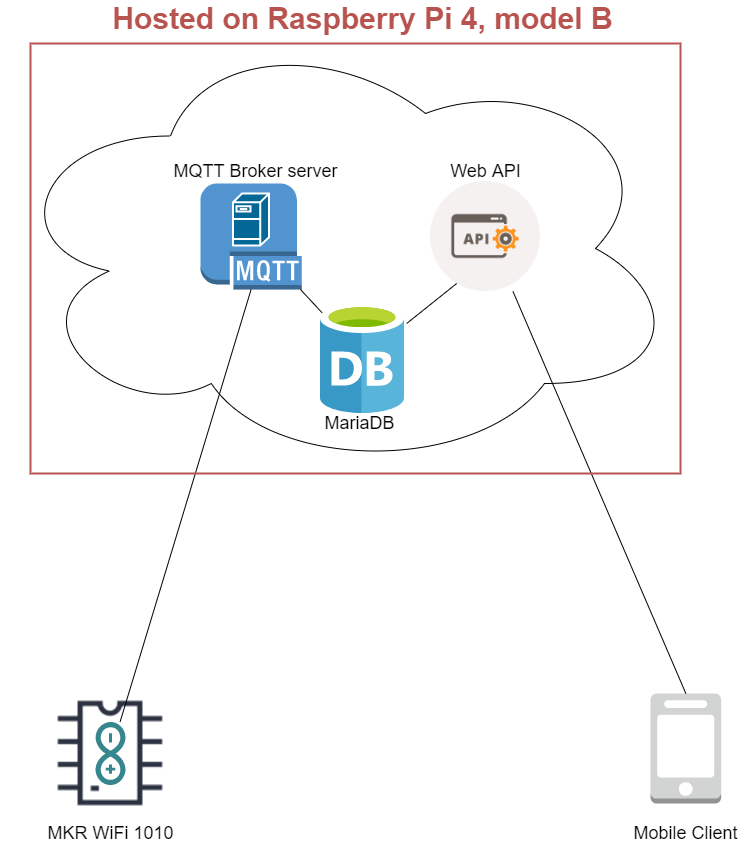
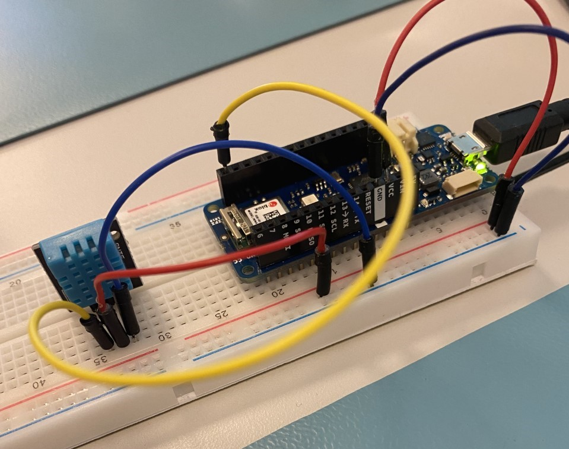
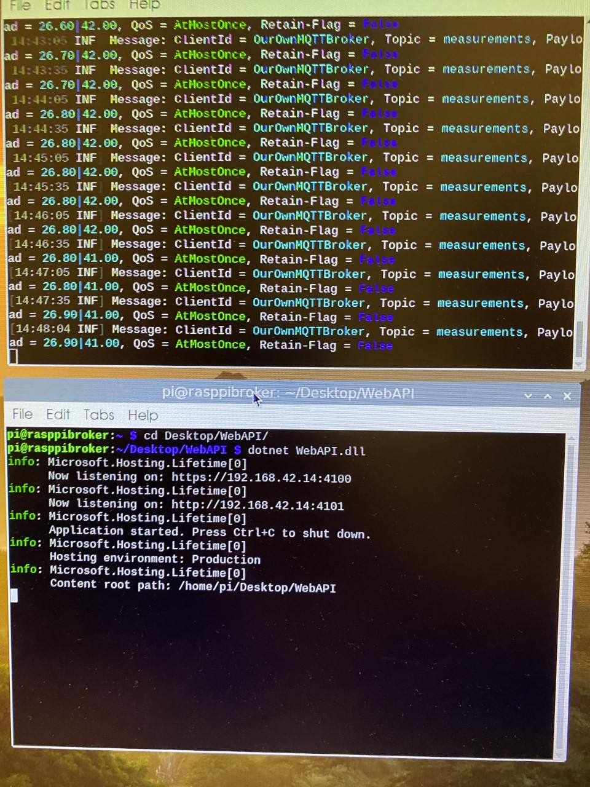
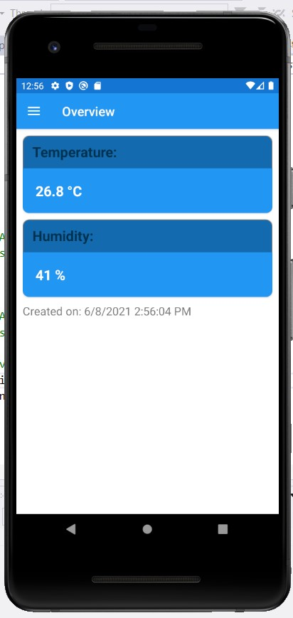
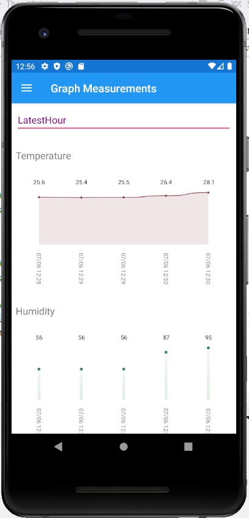

# MQTT Broker Server



&nbsp;

**Indholdsfortegnelse:**

* **General beskrivelse**
  * *Dette afsnit beskriver overordnet om projektet, så man får en forståelse for hvad projektet handler om og hvad projektet tager udgangspunkt i.*
* **Opsætning af eksempel projektet (SimpleMqttServer)**
  * *Dette forklare hvordan man starter ud med [SimpleMqttServer](https://github.com/SeppPenner/SimpleMqttServer) projektet og gør så det kan fungere på ens Raspberry Pi, med Raspberry Pi styresystemet.*
* **Opsætning af Raspberry Pi**
  * *Dette afsnit beskriver hvordan vi har opsat nogle af de forskellige ting på vores Raspberry Pi*
  * **Opsætning af hostname** 
  * **Opsætning af remote**
  * **Opsætning af firewall** 
* **Stage 1 demo**
  * *Dette afsnit viser og beskriver hvad vi fik til at virke i første del af opgaven. Blandt andet publish af MQTT Broker projektet og opsætningen af dette på Raspberry Pi'en*
* **Stage 2 demo**
  * *Dette afsnit viser og beskriver hvad vi fik til at virke i anden del af opgaven. Blandt andet at det embedded board kan publish temperatur og luftfugtigheds dataen op til MQTT Broker serveren og at den så ligger det ind i MariaDB databasen*
* **Stage 3 demo**
  * *Dette afsnit viser og beskriver hvad vi fik til at virke i trejde del af opgaven. Blandt andet har vi tilføjet en WebAPI til projektet og gjort så den hiver ned fra vores MariaDB database og mobil appen kan hente dataen fra API'et*
* **Krav/Analyse/Acceptance Test**
  * *Dette afsnit er vore krav, vores analyse og vores acceptance tests*
 

&nbsp;

&nbsp;

## General beskrivelse
Projektet handler om at lave en MQTT Broker server, som er lavet i .NET kode. MQTT Broker serveren kan smide den modtagende data over i en database og dertil skal der lave en WebAPI, som kan hente dataen fra databasen.
MQTT Brokeren vil modtage temperatur og luftfugtigheds data fra et MKR WIFI1010 board og det vil så blive muligt at hente dataen ned på en client (Web/Mobile), ved at kalde WebAPI'et.

Dette projekt er blevet hosted på en Raspberry Pi og her er det vigtigt at have installeret .NET runtime på Raspberry Pi'en. I vores tilfælde valgte vi .NET 5.0.x

&nbsp;

Projektet tager udgangspunkt i følgende eksempel projekt: [SimpleMqttServer](https://github.com/SeppPenner/SimpleMqttServer)

SimpleMqttServer projektet bruger følgende MQTTnet nugets:
* MQTTnet
* MQTTnet.Protocol
* MQTTnet.Server

Disse nugets er fra følgende git projekt: [MQTTnet](https://github.com/chkr1011/MQTTnet)
 
Projektet er lavet af Martin Sonne og Robert Iulian Zaharia

&nbsp;

&nbsp;

## Opsætning af eksempel projektet (SimpleMqttServer)

Eksempel projektet blev brugt på en Raspberry Pi, men da vi havde koden lagt over og vi derefter prøvede at publish koden på Raspberry Pi'en, så løb vi ind i en masse problemer.
I stedet for så valgte vi at publish koden til en folder, fra en anden computer af og så bagefter overføre den published mappe til Raspberry Pi'en, via et eksternt drev.

Her er det dog vigtigt at man f.eks ændre filepath'en, så den passer med den destination hvor koden skal køres, da den kode som var lavet i eksempel projektet, gør så når man publisher, så tager den filstien, til den computer som er published fra og det vil derfor ikke virke, når man smider den published kode over på en anden computer.

Det der skal ændres er pathen, som er efter "=" tegnet i currentPath variablen, som er inde i Main. Koden kan ses på kodeeksemplet under.
Den øverste udkommenterede koden er fra eksempel projektet og det under er det nuværende kode, som er brugt.
Grunden til at der er / imellem er fordi, at det her skal ligge på Raspberry Pi styresystem

```csharp
public static void Main()
{
	//var currentPath = Path.GetDirectoryName(Assembly.GetExecutingAssembly().Location);
	var currentPath = "/home/pi/Desktop/SimpleMQTTServer/SimpleMqttServer-master/src/SimpleMqttServer";

...
```

Nu skal path'en i filePath variablen også ændres, som er i ReadConfiguration metoden, med mindre der bruges Windows, så kan der bare bruges den del af eksempel koden.
Her er brugt Raspberry Pi styresystem, så der skal ændres \\ til / istedet for.

```csharp
private static Config ReadConfiguration(string currentPath)
{
	//var filePath = $"{currentPath}\\config.json";
	var filePath = $"{currentPath}/config.json";

...
```
 

&nbsp;

&nbsp;

## Opsætning af Raspberry Pi

Følgende er blevet gjort på Raspberry Pi'en:
* Installeret .NET 5.0 Runtime
* Opsætning af hostname
* Installeret MariaDB
* Konfigureret MariaDB til at kunne remote(til EF Core Migration og Update Database fra anden pc)
* Opsætning af firewall
* Konfigureret en bruger på MariaDB


### Opsætning af hostname

Vi har ændret hostname på Raspberry Pi'en, da de andre gruppers Raspberry Pi højst sandsynligt også havde samme hostname ("raspberrypi") og var koblet på samme Access Point. 

Dette kunne muligtvis give problemer, hvis man prøvede at connecte til MQTT Broker Serveren, via hostnamet

Guide til ændring af hostname: [Link](https://blog.jongallant.com/2017/11/raspberrypi-change-hostname/)


### Opsætning af firewall

Først tjekkes der lige om ufw firewall allerede er installeret, hvis ikke, så installer det.

Dette kan gøres ved at følge følgende guide: [Link](https://dev.to/delightfullynerdy/bash-ufw-command-not-found-ubuntu-18-04-1agh)

Når alt dette er gjort, så skal IP'en på den computer der vil add-migration og update database fra, tilføjes til allow listen på firewall'en.

For at tilføje en IP, som skal allowes på firewall'en, så skal der skrives følgende i terminal (ændre IP'en til den der skal allowes):
```shell
sudo ufw allow from 192.168.42.15 to any port 3306
```

Skriv derefter følgende, for at reload:
```shell
sudo ufw reload
```

&nbsp;

Husk også at allow IP'en på den embedded board (MKR WIFI 1010)

Dette gjorde vi på følgende måde
```shell
sudo ufw allow from 192.168.42.20
```

Skriv derefter følgende, for at reload:
```shell
sudo ufw reload
```


### Opsætning af remote

For at kunne add-migration og update database, til vores MariaDB database på Raspberry Pi'en, fra vores solution på windows PC'en, så skal der kunne connectes remote til MariaDB serveren og ikke kun via localhost.

Her skal der så lige sættes nogle ting op på Raspberry Pi'en, hvor MariaDB serveren køre.

Når MariaDB serveren er blevet installeret, så skal der gøres følgende:

Åben terminal og skriv:
```shell
cd /etc/mysql/mariadb.conf.d
```

Skriv derefter:

```shell
sudo nano 50-server.cnf
```

Udkommenter nu den linje vist med pilen på billedet under. Dette gøres ved at tilføje # foran "bind-address"


Nu skal der så restartes for MySQL/MariaDB serveren. Det gøres ved at skrive følgende:

```shell
sudo service mysqld stop
```

Skriv derefter:

```shell
sudo service mysqld start
```

Nu skulle MySQL/MariaDB serveren være oppe at køre igen.
Se eventuelt billedet under, markeret med rød boks og se bort fra alt andet der sker på screenshottet.


 

&nbsp;

&nbsp;

## Opsætning af embedded boardet

Det embedded board vi bruger er et MKR WIFI 1010.
Det er koblet til samme access point, som vores Raspberry Pi og vi har lavet projektet ved hjælp af Platform IO til Visual Studio Code.

Projektet har følgende libraries:
* WiFiNINA
* MQTT
* DHT
* Adafruit_Sensor
* Wire
* SPI

Projektet bruger følgende perifære enheder:
* DHT11 (Temperature & Himidity sensor)

&nbsp;

Her er linket til embedded projektet på GitHub: [EmbeddedMQTT](https://github.com/nitram1337/EmbeddedMQTT)

&nbsp;

Under ses billedet af boardet og DHT11'eren, som er koblet på og hvordan det er koblet til.


 

&nbsp;

&nbsp;

## Stage 1 demo

I første stage har vi fået sat MQTT broker serveren projektet op og gjort så den kører på Raspberry Pi'en.
Her var det vigtigt at have installeret .NET runtime på Raspberry Pi'en. Vi brugte følgende version: .NET 5.0.
Derefter publish'ede vi projektet på den computer hvor vi programmerede på (Windows 10 pc) og under publish valgte vi publish til folder og med følgende, som er set på billedet under

**Folder Publish Profile Settings:**


&nbsp;

Efter vi havde published til folder på Windows 10 maskinen, så tog vi et eksternt drev og flyttede den published folder fra Windows 10 pc'en og over på Raspberry Pi'en.
Derefter brugte vi følgende kommando i terminalen på Raspberry Pi

Gå ind i det published projekts mappe, som i vores tilfælde ligger på Desktop

cd /home/{BrugerNavn}/Desktop/{Navn på published projekt mappen, som ligger på desktop}
```shell
cd /home/pi/Desktop/MQTTBroker
```

For at køre den published kode har vi skrevet følgende:
```shell
dotnet SimpleMqttServer.dll
```

På billedet under kan ses vores MQTT Broker server, som er kørt via terminalen.
Her kan også ses at der bliver published 2 beskeder til brokeren.

**MQTT Broker server kørende på Raspberry Pi:**


&nbsp;

På billedet under kan der ses MQTTX som kører på en Windows 10 maskine og som publisher et 2 tal op til vores MQTT Broker server, som kører på Raspberry Pi'en og derefter får vores MQTT Client 2 tallet tilbage igen, da den også Subscriber på den samme Topic, som der blev Published til.
Billedet under passer ikke med det over, i forhold til at det der bliver sendt op ikke er det samme, som der står der er modtaget på billedet over - det er pga. at billederne er taget på forskellige tidspunkter.

**MQTT Client på anden pc, som bruger MQTT Broker serveren:**


 

&nbsp;

&nbsp;

## Stage 2 demo

I andet stage har vi koblet det embedded MKR WIFI 1010 board til og skrevet koden, så den kan sende op til vores egen MQTT Broker server.

Vi har også skrevet lidt om i koden til MQTT Broker serveren og tilføjet nogle ting, så nu når MQTT Broker Serveren modtager en publish fra Topic'en measurements, så smider den det over i MariaDB databasen.

Under kan der ses vores MQTT Broker server, som kører på vores Raspberry Pi. Her kan der ses at en ny client connecter og her kan også ses at en ny message bliver published op til vores MQTT Broker server.


På billedet under kan man se en udskrift til terminalen af det, som der også bliver published op til vores MQTT Broker.


På billedet under kan man se, at værdierne bliver lagt ind i vores MariaDB database, som blev sendt fra vores MKR WIFI 1010 board, via MQTT.


 

&nbsp;

&nbsp;

## Stage 3 demo

I trejde stage har vi tilføjet en Web API til projektet, som hiver målinger ned fra den samme database, som vores MQTT Broker server den smider målingerne op på.

Web API er tilføjet til projektet, på branchen "addingAPI"

Derefter har vi så lavet lidt om i vores Xamarin Forms projekt, som vi lavede på App Programmerings kurset.

Så nu kan mobil appen hive dataen ned fra vores Web API med seneste måling og med filtrering af om man vil se graf for seneste time, dag eller uges målinger.

På billedet under kan man se, at værdierne bliver modtaget på vores MQTT Broker server på den øverste terminal og på den nederste terminal kan ses vores Web API, som kører.



På billedet under kan man se seneste måling af temperatur og luftfugtighed, som er blevet hevet ned fra vores Web API, der ligger på vores Raspberry Pi



På billedet under kan man se de seneste målinger af temperatur og luftfugtighed og som er filtreret på "Latest Hour". Målingerne er blevet hevet ned fra vores Web API, der ligger på vores Raspberry Pi


 

&nbsp;

&nbsp;

## Kravspec

 

### User stories
>1.    Som bruger vil jeg gerne kunne se seneste temperature og luftfugtighed på mobil appen.
>2.    Som bruger vil jeg gerne kunne se en graf over den seneste times temperature og luftfugtigheds målinger.
>3.    Som bruger vil jeg gerne kunne se en graf over den seneste dags temperature og luftfugtigheds målinger.
>4.    Som bruger vil jeg gerne kunne se en graf over den seneste uges temperature og luftfugtigheds målinger.
>5.    Som bruger vil jeg gerne kunne vælge om målingerne skal være for seneste time, dag eller uge.

 &nbsp;

### Krav for system
>6.    Der skal kunne henter temperature og luftfugtighed fra en embedded board.
>7.    Embedded board skal kunne sende målinger til serveren hver 10 sekunder.
>8.    Embedded board skal kunne sender målinger via MQTT protokol til en MQTT broker server.
>9.    MQTT Broker serveren skal kunne gemme målinger på en database.
>10. En mobil app skal kunne henter målinger fra databasen vha. En API.
>11. MQTT Broker server, Database og API’en skal være på den samme enhed.

 &nbsp;

### Kravanalysering
Analysering for embedded board til **krav 6.**

 

**Problemstilling**
* Der skal bruges en enhed som kan hoste vores *MQTT Broker server*, *Database* og *API*. Der er ikke så mange personer som skal bruge den.

 

**Kandidater**
*    Raspberry PI
*    Dell Server R240 (Intel Xeon E-2200, 64 GB Ram, 4 HDD 56 TB, Ubuntu Server, S140 RAID, Rack Server)

 

**Kandidater Analyse**
| Raspberry PI | Dell Server  |
|----------|---------|
| **Fordele:** *Fylder slet ikke så meget at opbevare*, *Nemt til opgradering*, *Den støjer ikke så meget*| **Fordele:** *Hurtiger*, *Modulær*|
| **Ulemper:** *Begrænset mængde resources*, *Bliver hurtiger varm*| **Ulemper:** *Fylder mere opbevare*, *Den er støjende* |

 

**Konklusion**
* *Raspberry PI*

 

**Begrundelse**
* Uanset hvor kraftig den *Dell Server* er. Tinget er at vi har slet ikke brug for så en kraftig server, så raspberry PI den kan jo sagtens klare arbejdet.


<hr/>

&nbsp;


Analysering for embedded board til **krav 1.**

 

**Problemstilling**
* Der skal være et embedded board som kan måle og sender temperature og luftfugtighed via MQTT til en MQTT Broker server 

 

**Kandidater**
*    ATMega 2560
*    MKR Wifi 1010

 

**Kandidater Analyse**
| ATMega 2560 | MKR Wifi 1010  |
|----------|---------|
| **Fordele:** *Flere porter* | **Fordele:** *Fylder mindre*, *Har Wifi*, 48 Mhz clock speed|
| **Ulemper:** *Fylder mere*, *Ingen Wifi*, 16 Mhz clock speed | **Ulemper:** *Ikke så manger porter* |

 

**Konklusion**
* *MKR Wifi 1010*

 

**Begrundelse**
* Vi har valgt *MKR Wifi 1010* pga. den fylder mindre, vi har ikke brug for så mange porter og den har wifi antena og det er det vi har brug for at sender data op til vores *MQTT Broker server*.

 

<hr/>

&nbsp;

Analysering for embedded board til **krav 4.**

 

**Problemstilling**
* Der skal installeres en database som skal køres på en Raspberry PI og som bliver brugt af vores MQTT Broker og vores Web API som også bliver hosted på samme enhed.

 

**Kandidater**
*    MariaDB
*    MS SQL

 

**Kandidater Analyse**
| MariaDB | MS SQL  |
|----------|---------|
| **Fordele:** *Open-Source*, *Den kan køres på flere OS'er*, *Den understøtter flere programmerings sprog*, *Den kræver færre resource* | **Fordele:** *Hurtiger*, *Installation er streamlined*|
| **Ulemper:** *Mange ændringer skal laves for at sætte det op sådan som man vil bruge det*| **Ulemper:** *Fylder mere*, *commercial* |

 

**Konklusion**
* *MariaDB*

 

**Begrundelse**
* Vi har valgt *MariaDB* fordi den skal hostes på en *Raspberry PI* så har begrænset mængde resourcer og plads og også fordi der skal gøres ekstra ting for at installer *MS SQL* på en *Raspberry PI* og da vi ikke har erfaring med at installer *MS SQL* før.

 

<hr/>

&nbsp;

## Acceptance test
|Test nr.| Krav | Mål | Handling | Forventet resultat | Resultat |
|--|--|--|--|--|--|
|1 | 1 | Som bruger vil jeg gerne kunne se seneste temperature og luftfugtighed på mobil appen | Man åbner mobil appen og så klikker man på flyout menu i venstre side og bagefter man klikker på Overview. Du tager med et andet måleapperat, som er placeret samme sted, som den embedded controller og må maks afvige +/- 1 grad celsius. | Nu man kan se seneste måling af temperature og luftfugtighed som skal stemme overens med en måling. |  |
| 2 | 2 | Som bruger vil jeg gerne kunne se en graf over den seneste times temperature og luftfugtigheds målinger. | Man åbner mobil appen og så klikker man på flyout menu i venstre side og bagefter man klikker på Graph Measurements. Du tager måleapperat og skriv målinger ned hvor hver time. | Nu man kan se seneste times temperature og luftfugtigheds målinger. |  |
| 3 | 5 | Som bruger vil jeg gerne kunne vælge om målingerne skal være for seneste time, dag eller uge. | Man åbner mobil appen og så klikker man på flyout menu i venstre side og bagefter man klikker på Graph Measurements. På den side har du i toppen en dropdown, man klikker på den og så har du mulighed for at kunne se målinger for seneste time, dag eller uge. | Nu man kan se seneste time, dag eller uges temperature og luftfugtigheds målinger. | |
| 4 | 6 | Der skal kunne henter temperature og luftfugtighed fra en embedded board. | Man skal først tjekke om Embedded board og Raspberry PI er tænd. Ind på raspberry PI man åbner terminal ved at klikke på den fjerde ikon i venstre side ned og ind i den ny vindue man navigere til den rigtig folder ved at indtaste komandoen **cd Desktop/MQTTBroker/** . Her man skal kører programmet ved at indtaste **dotnet SimpleMqttServer.dll** og så trykker man enter. Hvis du kan se i vinduen *The MQTT Broker Server is now up and running!* så dvs. at programmet kører nu og den henter målinger fra Embedded board hver 10 sekunder.| Målinger skal kunne ses hver 10 sekunder ved teksten **payload=** | |


